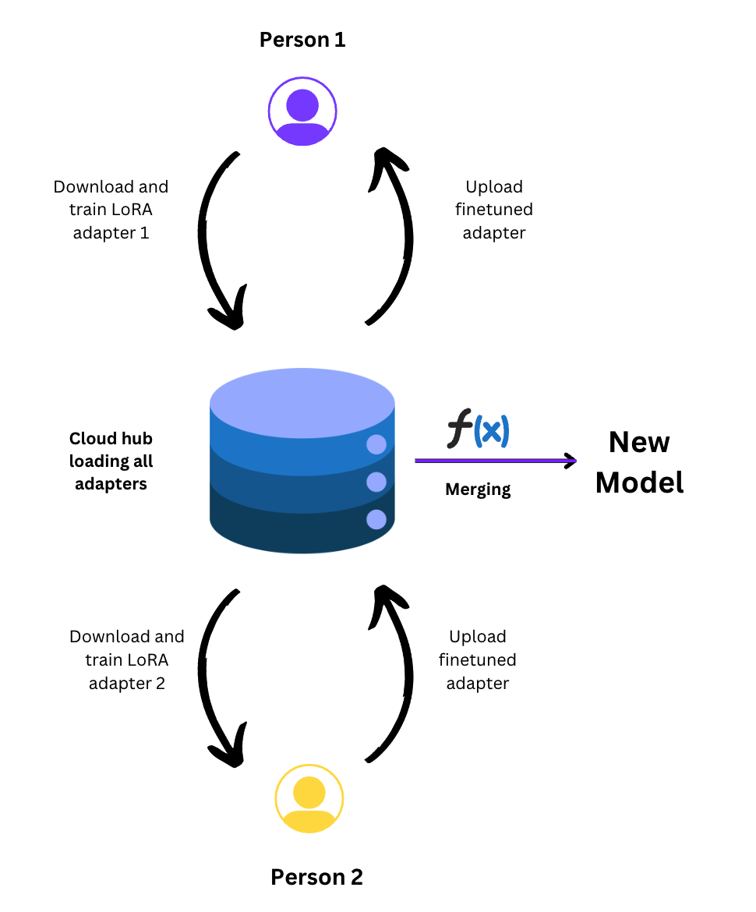

<p align="center">
  
</p>

<p align="center">
 <h2> <b>FedEm - A decentralized framework to train foundational models</b></h2>
</p>

<p align="center">

FedEm is an open-source library empowering community members to actively participate in the training and fine-tuning of foundational models, fostering transparency and equity in AI development. It aims to democratize the process, ensuring inclusivity and collective ownership in model training.
</p>

<h2> Introduction </h2>
The emergence of ChatGPT captured widespread attention, marking the first instance where individuals outside of technical circles could engage with Generative AI. This watershed moment sparked a surge of interest in cultivating secure applications of foundational models, alongside the exploration of domain-specific or community-driven alternatives to ChatGPT. Notably, the unveiling of LLaMA 2, an LLM generously open-sourced by Meta, catalyzed a plethora of advancements. This release fostered the creation of diverse tasks, tools, and resources, spanning from datasets to novel models and applications. Additionally, the introduction of Phi 2, an SLM by Microsoft, demonstrated that modestly-sized models could rival their larger counterparts, offering a compelling alternative that significantly reduces both training and operational costs.

Yet, amid these strides, challenges persist. The training of foundational models within current paradigms demands substantial GPU resources, presenting a barrier to entry for many eager contributors from the broader community. In light of these obstacles, we advocate for FedEm.

<b>FedEm (Federated Emergence)</b> stands as an open-source library dedicated to decentralizing the training process of foundational models, with a commitment to transparency, responsibility, and equity. By empowering every member of the community to participate in the training and fine-tuning of foundational models, FedEm mitigates the overall computational burden per individual, fostering a more democratic approach to model development. In essence, FedEm epitomizes a paradigm shift, where foundational models are crafted not just for the people, but by the people, ensuring inclusivity and collective ownership throughout the training journey.


<h2> FedEm Framework </h2>
FedEm proposes a methodology to train a foundational model continuously, utilizing adapters. FedEm can be elaborated in mainly two sections. Decentralization of adapter training using CRFs and large scale updation using continuous pretraining checkpoints.

<h3> Continuous Relay Finetuning (CRF) </h3>
<p align="center">
  <br>
  <b>Continuous Relay Finetuning</b>
</p>
We introduce the concept of continuous relay finetuning (CRF), which employs parameter-efficient LoRA adapters in a relay-like fashion for training foundational models. In this method, a client conducts local training of an adapter on a specified dataset, followed by its transmission to a cloud server for subsequent download by another client for further finetuning. FedEm ensures the continuous training of adapters, which are subsequently merged with a foundational model to create an updated model. CRF facilitates community engagement throughout the training process and offers a transparent framework for tracking and continuously updating adapters as new data becomes available, thereby enhancing the adaptability and inclusivity of AI development efforts.

<h3> Continuous Pretraining(CPT) </h3>

The server-side cloud hub exhibits the capability for perpetual training and deployment of refreshed foundational models at specified intervals, such as monthly or daily cycles. Simultaneously, the CRF adapters engage in iterative refinement against these newly updated models, fostering continual adaptation in response to evolving datasets.

<h2> Seshu </h2>
Majority, if not all the LLMs, we see today are based on proven Transformer based architectures. And Transfomres have quadratic (in inputs tokens) complexity - therefore slow to train and infer. As a result, new memory and compute efficient attention mechanisms have sprungup, along with Engineering hacks. But, at the end of the day, they are still based on Transformer-based architectures.
</br></br>
Further, majority, with the exception of some Chinese LLMs, are English-centric and other languages have a token representation (no pun intended). Often, LLMs have a particulalr tokenizer -- which makes extension to other languages/ domains hard. Vocabulary size and Transfomers Computational Efficiency have an uneasy relationship. Developing SLMs or LLMs is still a compute heavy problem. Therefore, only large consortia with deep pockets, massive talent concentration and GPU farms can afford to build such models.

<h2>Client side </h2>

It is as simple as it gets!

#### installation
```bash
$ pip install fedem
```


#### Examples
| Filename  | Google Colab Support  |
|---|---|
| Fedem Client  |  <a href="https://colab.research.google.com/mlsquare/fedem/blob/dev-phase-2/notebooks/fedem_seshu_client.ipynb"></a> |
| Fedem Server  | <a href="https://colab.research.google.com/mlsquare/fedem/blob/dev-phase-2/notebooks/fedem_seshu_server.ipynb"></a> |


#### Pre-reqs
 - has GPU, registers on HuggingFace/mlsquare for write access
 - familair with HuggingFace ecosystem (transfomers, peft, datasets, hub)
 - [optional] can donate time or data or both

#### Actions:
Runs client side sscript which
 - downloads data, pretrains model
 - SFTs via LoRA
 - pushes the adapter to HuggingFace model hub


<h2>Server (who manages the federated learning)</h2>

#### import and create a Seshu object
```python
from fedem.server import Seshu
from transformers import TrainingArguments
model = Seshu("/content/adapters.json", "/content/model_parameters.json")

```

#### pretrain!
```python
model.pretrain()
```

#### merge adapters and evaluate!
```python
model.model_merge_eval(
    adapters="mlsquare/pico_seshu_test",
    data = "mlsquare/SERVER_samantar_mixed_val"
)
```


#### Pre-reqs
- has (big) GPU(s)
- is familair with HuggingFace ecosystem (transfomers, peft, datasets, hub), databases, ML Enginneering in general
- [optional] can donate time or data or both

#### Actions:
 - Pretrains a multi-lingual Mamba model, publushes a checkpoint
 - Evaluated the community contributed adapters in a single-blind fashion, and merges them into the pretrained model
 - Does continous pretrainning, and releases checkpoints periodically

### Academic Interests
 - experiment and identity good federating learning policies
 - figure out effective training configurations to PT, CPT, SFT, FedT SLMs and LLMs
 - develop new task specific adapters
 - contribute your local, vernacular data
 - curate datasets


 ## Roadmap

### Week 0
- ~~Make Mamba compatiable with Transformer class~~
- ~~Test LoRA adapters (adding, training, merging)~~
- ~~Pretrain an SLM, SFT on LoRA, Merge, Push~~
Outcome: A working end-to-end Pretraining and SFT-ing pipeline[DONE]

### Week 1
- ~~Develop client-side code[~~
- ~~On multi-lingual indic dataset such as [samantar](https://huggingface.co/datasets/ai4bharat/samanantar), pretrain a model~~
- Release a checkpoint[DONE]

### Week 2
- ~~Drive SFT via community (at least two users)~~
- ~~Run Federated SFT-ing[~~

### Week 4 and onwards
- Benchmark and eval on test set (against other OSS LLMS)
- Perplexity vs Epochs (and how Seshu is maturing)


### References:
Architectures and Tokenizers
- Mamba: Linear-Time Sequence Modeling with Selective State Spaces, [paper](https://arxiv.org/abs/2312.00752),  1st, Dec, 2023
- MambaByte: Token-free Selective State Space Model [paper](https://arxiv.org/abs/2401.13660), 24th, Jan, 2024
- BlackMamba -  Mixture of Experts of State Space Models [paper](https://static1.squarespace.com/static/658ded386c43c219ee47caba/t/65bd73200920d050ccbac40c/1706914594353/blackMamba.pdf), [code](https://github.com/Zyphra/BlackMamba)
- ByT5: Towards a token-free future with pre-trained byte-to-byte models [paper](https://arxiv.org/abs/2105.13626), 28th, May, 2023

Indic LLMs
- RomanSetu: Efficiently unlocking multilingual capabilities of Large Language Models models via Romanization [paper](https://arxiv.org/abs/2401.14280), 25th, Jan, 2024
- Open Hathi - [blog](https://www.sarvam.ai/blog/announcing-openhathi-series) from sarvam.ai, 12th Dec, 2023
- MaLA-500: Massive Language Adaptation of Large Language Models [paper](https://arxiv.org/abs/2401.13303)

Model Merging
- Model soups: averaging weights of multiple fine-tuned models improves accuracy without increasing inference time [paper](https://arxiv.org/abs/2203.05482)
- Editing Models with Task Arithmetic [paper](https://arxiv.org/abs/2212.04089)
- TIES-Merging: Resolving Interference When Merging Models [paper](https://arxiv.org/abs/2306.01708)
- Language Models are Super Mario: Absorbing Abilities from Homologous Models as a Free Lunch [paper](https://arxiv.org/abs/2311.03099)
- Rethinking Alignment via In-Context Learning (implments token distribution shift) [blog](https://allenai.github.io/re-align/)
- PhatGoose: The Challenge of Recycling PEFT Modules for Zero-Shot Generalization [blog](https://colinraffel.com/blog/phatgoose.html)
- LoRA Hub: Efficient Cross-Task Generalization via Dynamic LoRA Composition (https://arxiv.org/abs/2307.13269)

Datasets
- samantar [here](https://huggingface.co/datasets/ai4bharat/samanantar)

Code & Tools for Models, and Distributed Training
- Mamba-HF: Mamba model compatible with HuggingFace transformers [here](https://github.com/LegallyCoder/mamba-hf/tree/main)
- Mamba pretrained model collection [here](https://huggingface.co/collections/Q-bert/mamba-65869481595e25821853d20d)
- Mamba-minimal: a minimal implementaiton of Mamba architecture [here](https://github.com/johnma2006/mamba-minimal)
- Mamba: original implementation by Mama authors [here](https://github.com/state-spaces/mamba/tree/main)
- OLMo: A truly open LLM [blog](https://blog.allenai.org/hello-olmo-a-truly-open-llm-43f7e7359222)
- Petals: decentralized inference and finetuning of large language models [blog](https://research.yandex.com/blog/petals-decentralized-inference-and-finetuning-of-large-language-models), [paper](https://arxiv.org/abs/2209.01188), [git repo](https://github.com/bigscience-workshop/petals)
- position blog on Petals: a shift in training LLMs with Petals network [techcrunch blog](https://techcrunch.com/2022/12/20/petals-is-creating-a-free-distributed-network-for-running-text-generating-ai/)
- Shepherd: A Platform Supporting Federated Instruction Tuning [here](https://github.com/JayZhang42/FederatedGPT-Shepherd)
- FATE-LM is a framework to support federated learning for large language models(LLMs) [here](https://github.com/FederatedAI/FATE-LLM)
- FEDML Open Source: A Unified and Scalable Machine Learning Library for Running Training and Deployment Anywhere at Any Scale [here](https://github.com/FedML-AI/FedML)
- mergekit for model merign to implement multiple model merging techiques [here](https://github.com/arcee-ai/mergekit)


### Note:
The views expressed or approach being taken - is of the individuals, and they do not represent any organization explicitly or implicitly.
Likewise, anyone who wants to contribute their time, compute or data must understand that, this is a community experiment to develop LLMs by the community, and may not result in any significant outcome. On the contrary, this may end up in total failure. The contributors must take this risk on their own.
